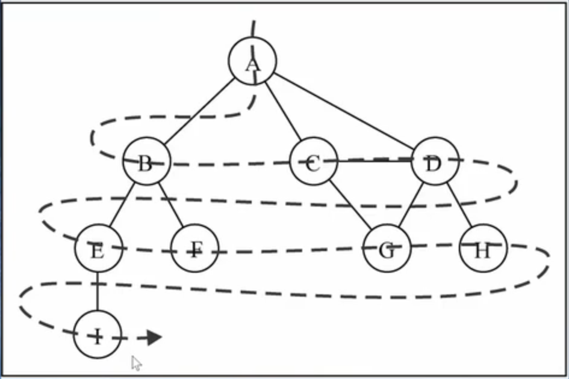
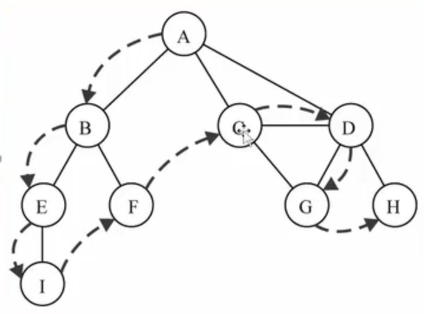

# 图论

## 1. 什么是图

- 图论是数学的一个分支，在数学概念上，树是图的一种
- 它以图为研究对象，研究`顶点`和`边`组成的`图形的数学理论和方法`
- 主要研究的目的是`事物之间的关系`，`顶点`代表`事物`,`边`代表两个事物间的`关系`
- 图的现实案例
  - 人与人之间的关系网（六度空间理论：世界上任何两个互不认识的两人，只需很少的中间人就可以建立起联系）
  - 北京地铁图
  - 村庄间的关系网

> 图结构的特点

- 一组顶点： 通常用V（Vertex）来表示顶点的集合
- 一组边： 通常用E（Edge）表示边的集合
  - 边是顶点和顶点之间的连线
  - 边可以是有向的，也可以是无向的
  - 比如A--B表示无向，A-->B表示有向

> 相关术语

度: 一个顶点的度是相邻顶点的数量

路径：顶点的一个连续序列，包括简单路径（不包含重复顶点），回路（第一个顶点和最后一个顶点想用）

有向图：所有的边都是有方向的

有权图：边有一定的权重

> 图的表示

1. 邻接矩阵
   - 让每个节点和一个整数相关联，该证书作为数组的下标值
   - 用一个二维数组来表示顶点之间的连接
   - 可以直观的表示有向图，有权图
   - 二维数组[0] [2] => A => C
   - `存在问题`：如果图是稀疏图，会大量浪费计算机资源
2. 邻接表
   -  由图中每个顶点以及和顶点相邻的顶点列表组成
   - 列表可以是数组/链表/字典
   - `存在问题`：计算有向图的“入度”比较麻烦，需要构造一个“逆邻接表”，但开发中一般使用比较少

## 2. 图结构封装

> 创建graph类

 ```javascript
function Graph () {
  // 存储顶点
  this.vertexs = []
  // 邻接表存储边，用map来代替字典数据类型
  this.edges = new Map()
  // 增加顶点的方法
  Graph.prototype.addVertex = function(vertex) {
    this.vertexs.push(vertex)
    this.edges.set(vertex, [])
  }
  // 增加边的方法，v1为顶点1
  Graph.prototype.addEdge = function(v1, v2) {
    // 增加双向的边
    this.edges.get(v1).push(v2)
    this.edges.get(v2).push(v1)
  }
  // 图的toString方法
  Graph.prototype.toString = function() {
    var string_graph = ''
    for(var i = 0;i < this.vertexs.length;i++) {
      string_graph += this.vertexs[i] + ': '
      for(var j = 0;j < this.edges.get(vertexs[i]).length;j++) {
        string_graph += this.edges.get(vertexs[i])[j] + ' '
      }
      string_graph += '\n'
    }
    return string_graph
  }
}
 ```

## 3. 图的遍历

> 图的遍历思想

- 和树的遍历思想相同
- 意味着将图中每个顶点访问一遍，并且不能有重复的访问

> 两种图的遍历方法

- 广度优先搜索（BFS）：基于队列，入队列的顶点先被搜索
- 深度优先搜索（DFS）：基于栈或者使用递归，通过将顶点存入栈中，顶点是沿着路径被搜索的，存在新的相邻顶点就去访问
- 都要明确第一个被访问的顶点

> 记录顶点的状态

- 白色：表示该顶点还没有被访问
- 灰色：表示该顶点被访问过，但未被探索过
- 黑色： 表示该顶点被访问过且被完全探索过

> 初始化顶点状态颜色代码

```javascript
// 初始化顶点的状态
  Graph.prototype.initialVertexsState = function() {
    this.color = []
    for(var i = 0;i < this.vertexs.length;i++) {
      this.color[i] = 'white'
    }
  }
```

## 4. 广度优先搜索

> 思路

- 从指定的第一个顶点开始遍历图，先访问其所有的相邻点，就像一次访问图的一层
- 换句话说，就是先宽后深的访问顶点



> 广度优先搜索的实现

- 创建一个队列
- 将v标注为被发现的(灰色)，并将v加入队列Q
- 如果Q非空，执行下面的步骤：
  - 将v从Q中取出队列
  - 将v标注为被发现的灰色
  - 将v所有的未被访问过的邻接点（白色），加入到队列中
  - 将v标志为黑色 

> 广度优先搜索的代码实现

```javascript
// 广度优先算法BFS
  Graph.prototype.BFS = function (initVertex, handle) {
    // 1.初始化一个队列
    var queue = []
    // 2.把初始顶点加入到队列中
    queue.push(initVertex)
    // 3.设置初始点的状态为已遍历
    this.color[initVertex] = 'grey'
    // 4.BFS遍历initVertex顶点
    while (queue.length > 0) {
      // 4.1 弹出要处理的顶点
      var handleVertex = queue.shift()
      // 4.2 获取处理顶点的所有连接顶点
      var vList = this.edges.get(handleVertex)
      // 4.3 将没有遍历过的顶点加入队列中
      for (var i = 0;i < vList.length;i++) {
        if (this.color[vList[i]] === 'white') {
          queue.push(vList[i])
          // 设置初始点的状态为已遍历
          this.color[vList[i]] = 'grey'
        }
      }
      // 4.4 处理顶点
      handle(handleVertex)
      // 4.5 设置初始点的状态为已处理
      this.color[handleVertex] = 'black'
    }
  }
```

## 5. 深度优先搜索

> 思路

- 从第一个指定的顶点开始遍历图，沿着路径知道直到这条路径最后被访问了。
- 接着原路回退并探索出一条路径



> 深度优先搜索的实现

- 实现可以用队列，也可以使用栈或者递归
- 此处的代码实现使用递归（递归本质上就是函数栈的调用）

> 代码实现

```javascript
// 深度优先搜索算法
  Graph.prototype.DFS = function (initVertex, handle) {
    this.dfs_search(initVertex, handle, this.color)
  }
  // dfs递归搜索函数
  Graph.prototype.dfs_search = function (initVertex, handle, color) {
    // 1. 设置初始点的状态为已遍历
    color[initVertex] = 'grey'
    // 2. 运行处理节点函数
    handle(initVertex)
    // 3. 取出处理顶点的连接顶点
    var vList = this.edges.get(initVertex)
    // 4. 对没有遍历过的连接顶点进行递归dfs函数操作
    for (var i = 0;i < vList.length;i++) {
      if (color[vList[i]] === 'white') {
        this.dfs_search(vList[i], handle, color)
      }
    }
    // 5.设置初始点的状态为已处理
    color[initVertex] = 'black'
  }
```


